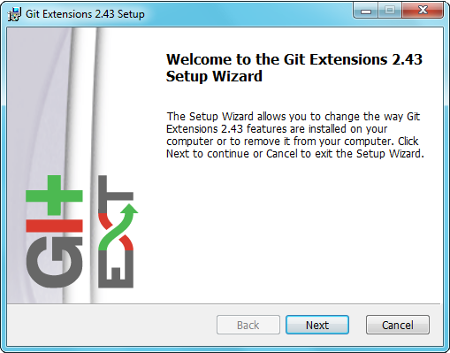

Getting Started
===============

Installation
------------

There is a single click installer that installs MSysGit, kdif3 and Git Extensions. The installer will detect if 32bit and/or 64bit versions should be installed.
The installer can be found `here <http://code.google.com/p/gitextensions/>`_

